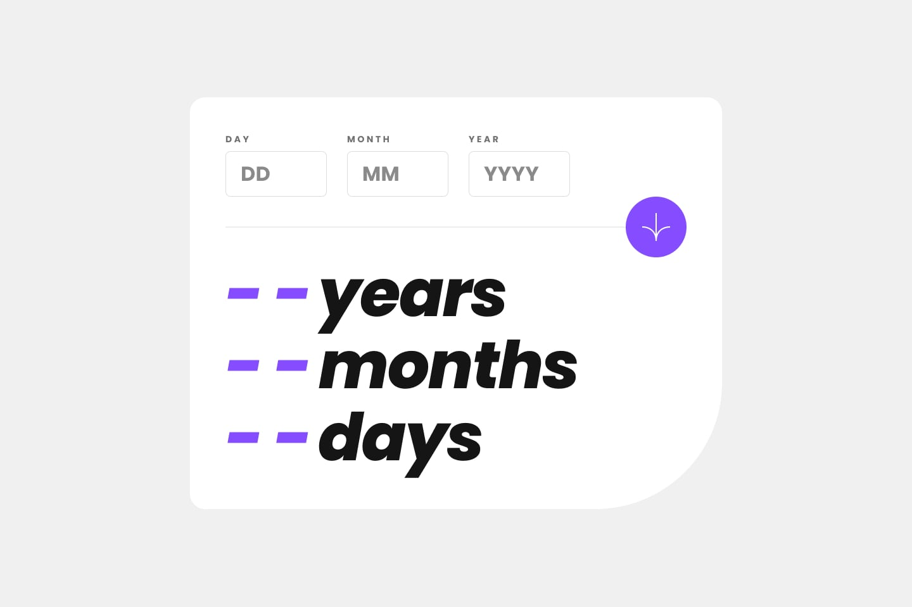
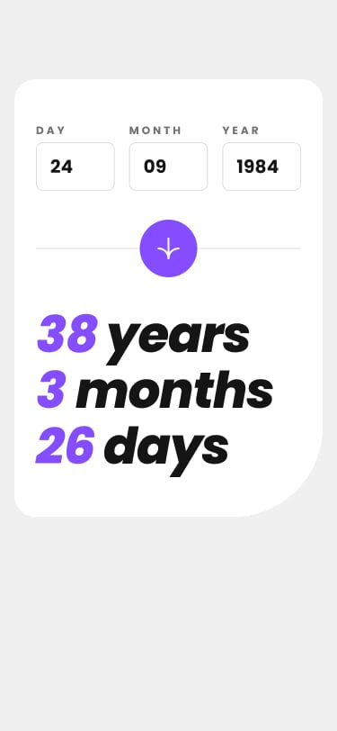

# 🎂 Age Calculator App

> Calculadora de idade feita com muito ☕ e HTML, CSS e JavaScript puro (vanilla, na régua)!


🔗 **Veja rodando ao vivo:** [anaclarissi.github.io/age-calculator](https://anaclarissi.github.io/age-calculator/)


---

## ⚠️ Aviso importante

Este projeto foi desenvolvido **exclusivamente para fins de estudo e prática**, como parte dos desafios da plataforma [Frontend Mentor](https://www.frontendmentor.io/). Não possui fins comerciais. 🙅‍♀️💰

---

## 👀 Preview

<p align="center">
  
</p>
<p align="center">
  
</p>


---

## 🚀 Sobre o projeto

Um app simples e elegante que calcula sua idade exata em **anos, meses e dias** a partir da data de nascimento informada. O grande desafio aqui não foi só fazer a conta bater — foi fazer ela bater **certo**, considerando anos bissextos, meses com quantidades diferentes de dias e todas aquelas pegadinhas que datas adoram nos aprontar. 📅✨

O desafio original é do Frontend Mentor, veja aqui:
🔗 [Age Calculator App — Frontend Mentor](https://www.frontendmentor.io/challenges/age-calculator-app-dF9DFFpj-Q)

---

## 🧠 O que eu aprendi

Esse desafio pareceu simples no papel, mas escondia várias pegadinhas boas. Aqui vai o que mais me marcou:

- 📆 **Validação de datas de verdade é chata (e importante)** — verificar se um dia existe de fato dentro do mês/ano escolhido (adeus, 31 de fevereiro) exigiu ir além do básico de `if/else`.

- 🔄 **Manipulação do objeto `Date` do JavaScript** — aprendi a lidar com `getFullYear()`, `getMonth()`, `getDate()` e a lógica de "pedir emprestado" dias/meses quando a subtração dá número negativo.

- 🎨 **CSS mais esperto com `:has()`** — usei o seletor `:has()` para estilizar o `label` e o `input` com base no estado de erro, sem precisar de JS extra para isso.

- 📱 **Responsividade em múltiplos breakpoints** — trabalhei com vários pontos de quebra (mobile pequeno, mobile grande, tablet, desktop, telas grandes) pra deixar tudo consistente em qualquer tamanho de tela.

- ♿ **Acessibilidade básica de formulário** — usei `aria-labelledby`, mensagens de erro dinâmicas e `required` para deixar o form mais amigável.

- 🧩 **Organização de funções JS** — separar responsabilidades (validação de dia, mês, ano, data completa, exibição de erro) deixou o código bem mais fácil de ler e debugar.

---

## 🛠️ Tecnologias utilizadas

- **HTML5** semântico
- **CSS3** (Grid, Flexbox, variáveis CSS, `:has()`)
- **JavaScript** puro (sem frameworks, sem libs)

---

## 💻 Como rodar localmente

Quer testar na sua máquina? Sem segredo, é só seguir os passos abaixo:

```bash
# 1. Clone o repositório
git clone https://github.com/anaClarissi/age-calculator.git

# 2. Entre na pasta do projeto
cd age-calculator

# 3. Abra o arquivo index.html no seu navegador
# (pode ser com duplo clique ou usando uma extensão tipo Live Server no VS Code)
```

Não tem build, não tem `npm install`, não tem dependência nenhuma. É só abrir e usar! 🎉

---

## 🔗 Links

- 🌐 Site no ar: [anaclarissi.github.io/age-calculator](https://anaclarissi.github.io/age-calculator/)
- 🎯 Desafio original: [Frontend Mentor — Age Calculator App](https://www.frontendmentor.io/challenges/age-calculator-app-dF9DFFpj-Q)
- 👩‍💻 Meu perfil no Frontend Mentor: [anaClarissi](https://www.frontendmentor.io/profile/anaClarissi)

---

<p align="center">Feito com 💜 por <strong>Ana Clarissi</strong> — só estudando e evoluindo, um desafio de cada vez!</p>